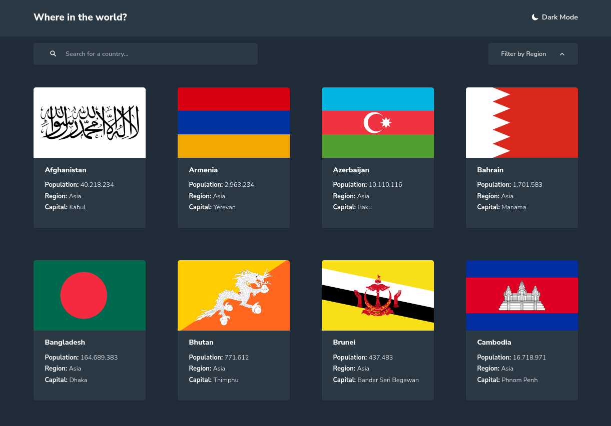
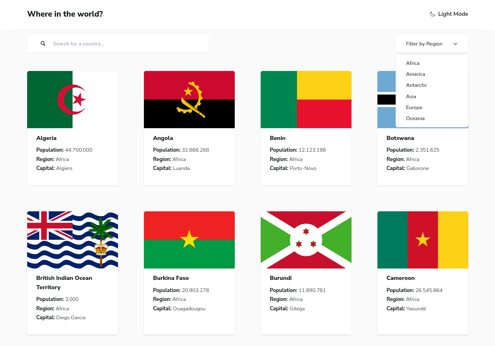
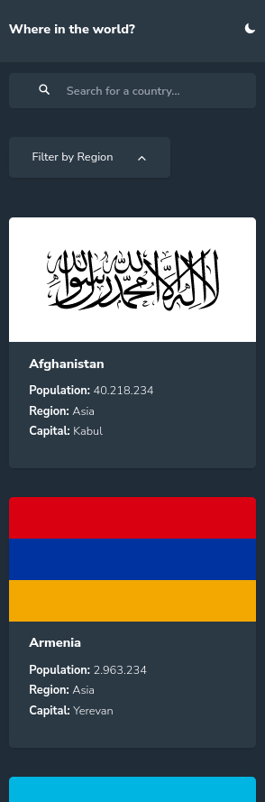
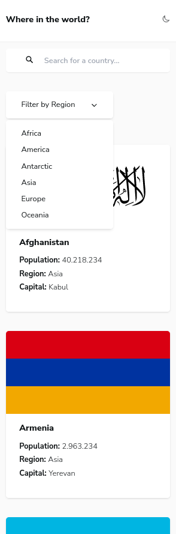
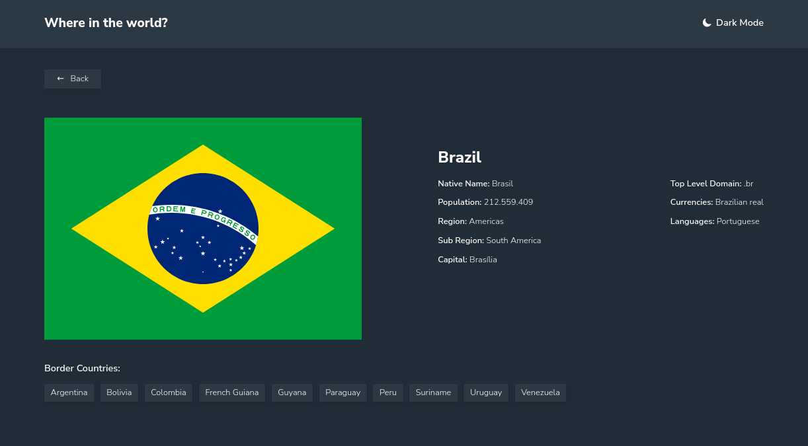
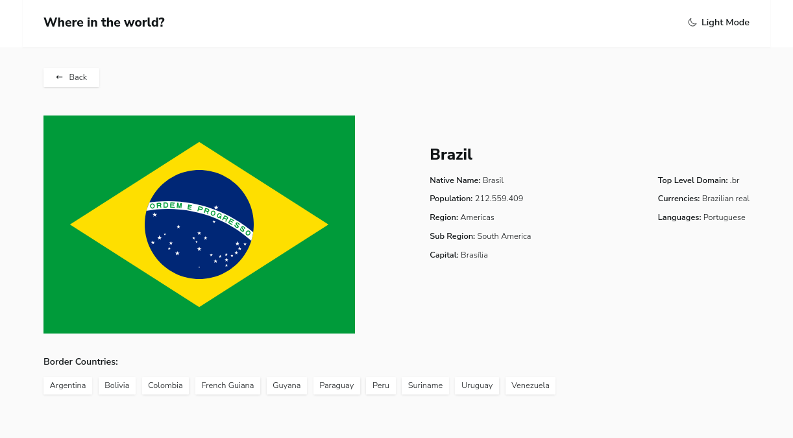
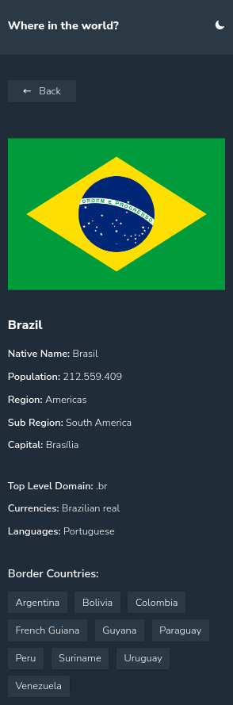
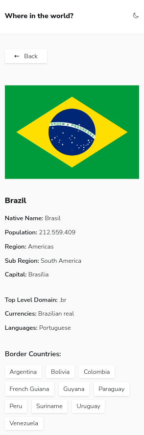

# 👨‍💻‍ Sobre o projeto

Worldpedia é um Web App que permite aos seus usuários navegar pelo globo e descobrir informações sobre seus países favoritos.
Suas principais funcionalidades são:

- Filtrar países por nome;
- Filtrar países por região;
- Acessar dados mais detalhados sobre um país ao clicar nele;
- Acessar dados mais detalhados sobre países fronteiriços

Esse projeto foi inspirado em um
<a href="https://www.frontendmentor.io/challenges/rest-countries-api-with-color-theme-switcher-5cacc469fec04111f7b848ca" target="_blank">desafio</a>
do site <a href="https://www.frontendmentor.io" target="_blank">frontend mentor</a>, que tem como proposta
consumir os dados da API <a href="https://restcountries.com/" target="_blank">rest countries</a> e exibi-los em duas páginas: homepage e datails page.

### 🧰 Ferramentas Utilizadas

- <a href="https://vitejs.dev/" target="_blank">Vite</a>
- <a href="https://react.dev/" target="_blank">React</a>
- <a href="https://reactrouter.com/en/main" target="_blank">React Router</a>
- <a href="https://tailwindcss.com/" target="_blank">Tailwind</a>
- <a href="https://ionic.io/ionicons" target="_blank">Ionicons</a>
- <a href="https://docs.npmjs.com/downloading-and-installing-node-js-and-npm" target="_blank">NPM</a>

## 💿 Como rodar na sua máquina

### Pré-requisitos

- **Git**;
- **Node + NPM**;

```shell
# Clone o repositório na sua máquina
$ git clone https://github.com/lleonardus/worldpedia

# Abra a pasta do projeto
$ cd worldpedia

# Instale as dependências
$ npm i

# Inicie o projeto
$ npm run dev
```

Após esse processo, o App vai estar rodando em **http://localhost:5173**

## 🗺️ Rotas

- `/` : Leva até a homepage. Nessa rota são apresentados todos os países contidos na API <a href="https://restcountries.com/" target="_blank">rest countries</a>.
- `/region/:region`: Também leva até a homepage, com a diferença de apresentar apenas os países da região escolhida.
- `/country/:countryName`: Leva a uma página que mostra informações mais detalhadas sobre um país em específico (details page).

## 📸 Screenshots

### Exemplo utilizando a url `/region/Asia`






### Exemplo utilizando a url `/country/Brazil`





